# Tour Planner Protocol

## 1. Project Overview

Project: Tour Planner  
Course: SWEN 2  
Stack: Angular 21, ASP.NET Core (.NET 10), Entity Framework Core, PostgreSQL, Serilog, NUnit, Vitest, Leaflet, OpenRouteService

The goal of the project was to build a web-based tour planning application with a clear frontend/backend split, a layered backend architecture, MVVM in Angular, persistence through PostgreSQL, external routing/geocoding integration, automated tests, and one mandatory unique feature.

The final application allows a user to:

- register and log in
- create, update, delete, and list tours
- calculate routes with external APIs and display them with Leaflet
- create, update, delete, and list tour logs
- search through tours and log-related text
- import and export tour bundles
- view computed attributes such as popularity and child-friendliness
- use a statistics dashboard as the mandatory unique feature

---

## 2. Startup Instructions

This section is intentionally explicit so the lector can start the project without guessing hidden configuration.

### 2.1 Required tools

- .NET SDK 10
- Node.js 20+
- npm 10+
- Docker Desktop

### 2.2 Secret/config files

Two example files are included to show the required secret structure:

- `backend/.env.example`
- `backend/secrets.json.example`

`backend/.env` configered like in `backend/Secrets/.env.example` is used by Docker Compose for PostgreSQL:

```env
POSTGRES_DB=tourplanner
POSTGRES_USER=tourplanner
POSTGRES_PASSWORD=...
```

`backend/Secrets/secrets.json.example` shows the secret keys expected by the API:

```json
{
  "ConnectionStrings": {
    "DefaultConnection": "Host=localhost;Port=5432;Database=tourplanner;Username=tourplanner;Password=..."
  },
  "Routing": {
    "OpenRouteServiceApiKey": "..."
  },
  "Jwt": {
    "SigningKey": "BASE64_ENCODED_32_BYTE_PLUS_SECRET"
  }
}
```

Important:

- `.env.example` is copied to `.env` for Docker Compose.
- `secrets.json.example` is not loaded directly by ASP.NET at runtime. It documents which values must be stored in .NET User Secrets on the local machine.
- `Jwt:SigningKey` is mandatory. Without it, the API does not start.

### 2.3 Backend setup

1. Copy the Docker environment file:

```powershell
cd backend
Copy-Item .env.example .env
```

2. Start PostgreSQL and pgAdmin:

```powershell
docker compose up -d
```

3. Store the API secrets in .NET User Secrets:

```powershell
dotnet user-secrets set --project TourPlanner.API "ConnectionStrings:DefaultConnection" "Host=localhost;Port=5432;Database=tourplanner;Username=tourplanner;Password=..."
dotnet user-secrets set --project TourPlanner.API "Routing:OpenRouteServiceApiKey" "..."
dotnet user-secrets set --project TourPlanner.API "Jwt:SigningKey" "BASE64_ENCODED_32_BYTE_PLUS_SECRET"
```

4. Apply the EF Core migrations:

```powershell
dotnet ef database update --project TourPlanner.DataAccessLayer --startup-project TourPlanner.API
```

5. Start the API:

```powershell
dotnet run --project TourPlanner.API
```

The development profile runs on:

- `http://localhost:5102`
- `https://localhost:7248`

### 2.4 Frontend setup

In a second terminal:

```powershell
cd frontend/TourPlannerWeb
npm.cmd install
npm.cmd start
```

The Angular frontend runs on:

- `http://localhost:4200`

### 2.5 First login flow

Because the backend is protected by JWT authentication, the normal first step is:

1. open `/auth`
2. register a new user
3. log in
4. continue to dashboard, tours, and logs

---

## 3. Technical Steps And Decisions

### 3.1 Frontend architecture

The frontend was built with Angular using MVVM:

- pages and components focus on rendering and user interaction
- viewmodels contain UI logic, validation, and computed state
- services hold shared state and backend communication
- Angular signals/computed values act as the reactive update mechanism

This kept presentation logic out of the templates and made unit testing cheaper.

### 3.2 Backend architecture

The backend follows a layered architecture:

- API layer: controllers, DTOs, mappers, middleware
- Business layer: domain rules, validation, orchestration services
- Data access layer: repositories and EF Core persistence
- Domain layer: entity model and enums

This separation made it easier to test business logic without HTTP or database dependencies in every test.

### 3.3 Persistence and search

Entity Framework Core with PostgreSQL was selected because:

- it satisfies the OR-mapper requirement
- migrations are easy to version
- PostgreSQL offers strong full-text search support

For full-text search, PostgreSQL `tsvector` shadow columns and GIN indexes were used. This kept search logic inside the database instead of transferring large amounts of data into the application and searching in memory.

### 3.4 External APIs

External route data is not guessed locally:

- Nominatim is used for place search/geocoding
- OpenRouteService is used for route calculation
- Leaflet renders the map in the Angular frontend

This decision directly matches the assignment requirements and keeps the route/distance/time calculation realistic.

### 3.5 Authentication and security

Authentication was implemented with:

- JWT access tokens
- refresh tokens
- password hashing with ASP.NET Identity hasher
- stricter password policy
- rate limiting on auth endpoints
- per-user data scoping enforced from controller down to repository

The scoping decision was especially important because the assignment explicitly says tours and logs must never be shared between users.

### 3.6 Logging

Serilog was chosen as the logging framework. It logs:

- request pipeline events
- repository operations
- business events such as create/update/delete
- file-based rolling logs plus console logs

This satisfies the logging requirement and is also useful during debugging and presentation.

### 3.7 Import/export

Import/export was implemented as JSON because:

- it matches the HTTP/DTO structure already used in the project
- it is easy to inspect manually
- it supports full nested data export of tours with logs

Validation is done during import so a partially broken file does not silently corrupt the database.

### 3.8 Mandatory unique feature

The mandatory unique feature is a statistics dashboard.

Final design decision:

- pure frontend feature
- no new backend endpoint
- aggregates data already loaded for tours and tour logs

Reason:

- cheaper to implement
- minimal backend risk
- still clearly unique and demonstrable
- easy to test with pure aggregation logic

The feature computes:

- average kilometers per month
- rating distribution
- top tour
- transport mix

Important implementation note:

An unfinished backend statistics slice had already been started. The final solution kept the actual feature frontend-only and only added the missing backend interface implementation so the .NET solution builds again without introducing a new API endpoint.

---

## 4. Problems, Failures, And Selected Solutions

### 4.1 Search complexity

At first, search was simpler on the frontend, but that does not scale well and does not satisfy the idea of true full-text search across persisted data. The final solution moved search responsibility into PostgreSQL through indexed `tsvector` columns and a dedicated repository query.

### 4.2 Computed attributes

Popularity and child-friendliness depend on tour logs, so storing them directly risks stale data. The chosen solution was to recompute them after every log create/update/delete in `TourLogService`. This keeps read performance high while still preserving correctness.

### 4.3 Unique feature scope

A backend statistics endpoint was not necessary for the mandatory feature. The cleaner solution was to use existing tour/log data already available on the client and aggregate it inside a pure frontend helper. This reduced API surface area and kept the feature lightweight.

### 4.4 Validation and startup configuration

Keeping configuration out of source code was a must-have. The project therefore splits configuration into:

- `appsettings.json` for non-secret defaults
- `.env` for Dockerized database startup
- .NET User Secrets for runtime secrets

To make this reproducible for grading, example files were added: `.env.example` and `secrets.json.example`.

---

## 5. Design Patterns Used

The project uses multiple patterns. The most important ones are:

- MVVM: Angular pages/components + viewmodels
- Repository: `ITourRepository`, `ITourLogRepository`, `IUserRepository`, `IRefreshTokenRepository`
- Adapter/Mapper: API DTO mappers convert between HTTP DTOs and domain objects
- Observer: Angular signals/computed reactively update the UI
- Facade: service classes provide a simplified interface over lower-level repository/API details
- Strategy: password policy and routing/profile mapping decisions are encapsulated behind interfaces/helpers

The design pattern I would explicitly highlight in the presentation is MVVM plus Repository, because both are visible in the structure and easy to explain with code.

---

## 6. Application Features

### 6.1 Core features

- user registration and login
- tour CRUD
- tour log CRUD
- map integration with Leaflet
- route calculation using OpenRouteService
- geocoding/search for places
- full-text search on persisted data
- computed popularity
- computed child-friendliness
- import/export
- responsive UI

### 6.2 Unique feature

Statistics Dashboard:

- average km per month
- rating distribution
- top tour
- transport mix

This is visible directly on the `/dashboard` route and does not require extra backend endpoints.

---

## 7. Why These Unit Tests Were Chosen

The most critical code paths are the ones where a bug would either:

- break core user functionality
- corrupt or misinterpret data
- expose security problems
- return wrong calculated values

For that reason the chosen tests focus on:

- routing service behavior and unit conversion
- auth session and JWT lifecycle
- password policy rules
- user scoping and access isolation
- computed tour statistics
- full-text search behavior
- import/export validation and round-tripping
- unique-feature dashboard aggregation

### 7.1 Especially critical tests

- Routing tests are critical because external API integration is fragile and distance/duration correctness directly affects tours.
- Auth tests are critical because a mistake there would break login, refresh, or logout behavior.
- Scoping tests are critical because cross-user data leaks are severe.
- Search tests are critical because full-text search combines API, BL, DAL, and PostgreSQL behavior.
- Import/export tests are critical because data exchange should not lose or corrupt nested tour/log data.
- Dashboard statistics tests are critical because the unique feature depends entirely on correct aggregation, grouping by month, deterministic tie-breaking, and empty-state handling.

### 7.2 Current automated test status

Verified on July 5, 2026:

- backend: 145 tests passed
- frontend: 10 tests passed
- total verified automated tests: 155

Additional verification:

- Angular production build succeeded
- .NET solution built through the test run after the unfinished statistics interface was completed

---

## 8. Time Tracking

Exact personal hours were not reconstructible from code alone, so this is an estimated milestone-based effort derived from the git history.

### 8.1 Estimated project effort

- project bootstrap and repository setup: 5 h
- Angular MVVM shell and base layout: 9 h
- tour management UI and CRUD: 11 h
- log management UI and CRUD: 9 h
- map integration with Leaflet and routing/geocoding: 11 h
- backend architecture, DAL/BL, EF migrations: 13 h
- auth, JWT, refresh tokens, security improvements: 9 h
- search, computed stats, user scoping: 9 h
- import/export: 6 h
- unique feature dashboard and tests: 5 h
- debugging, polishing, documentation: 8 h

Estimated total project effort: 95 h

### 8.2 Git milestone reference

The git history already documents the implementation sequence, for example:

- 2026-04-28: initial project setup
- 2026-05-30: Angular MVVM setup
- 2026-06-02 to 2026-06-03: map, auth page, tours, logs, UI improvements
- 2026-06-30: backend setup
- 2026-07-05: DAL/BL, logging, ORS integration, auth/security, search, import/export, user scoping
- 2026-07-05: mandatory unique feature completed as statistics dashboard

The assignment explicitly says the git history is part of the documentation, so it is not duplicated in full here.

---

## 9. UML Use Case Diagram

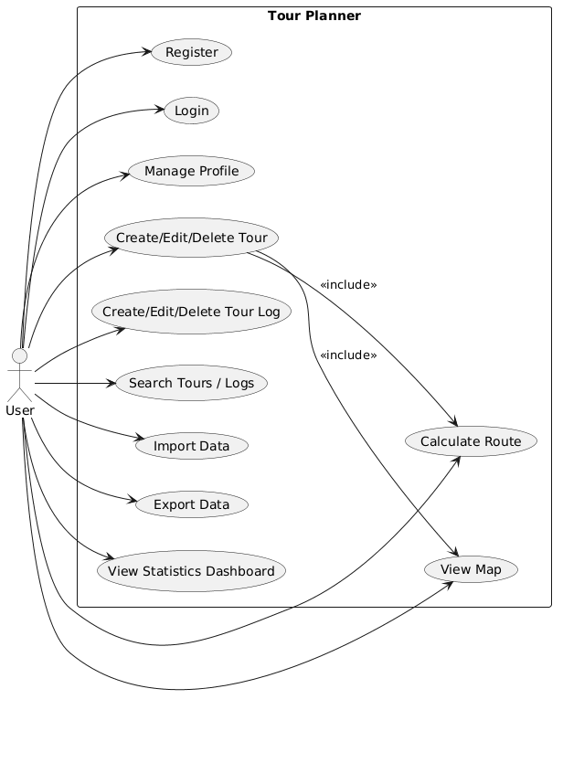

---

## 10. Wireframes / UI Flow

Figma-Link: https://www.figma.com/make/vzG9usKZBdfjT5VZbO7QFL/Tour-List-Dashboard-Wireframe?p=f&t=oR58N5M8hZSy0DCw-0

Initial Design:
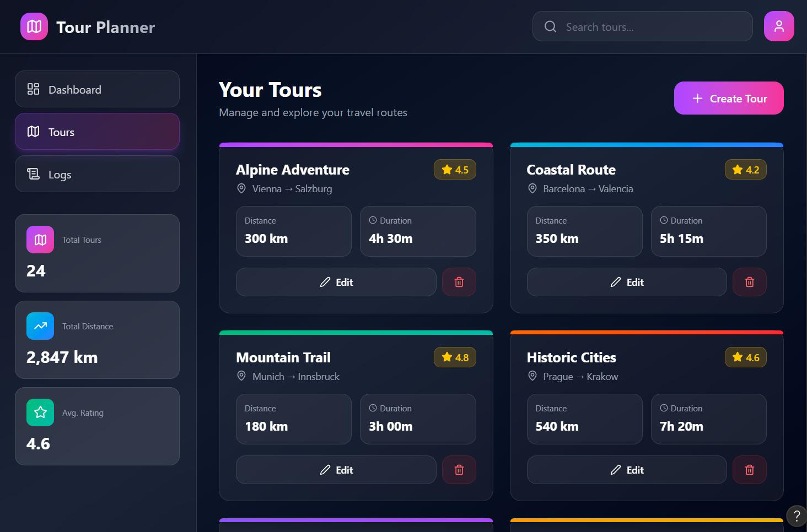

### 10.1 Auth flow

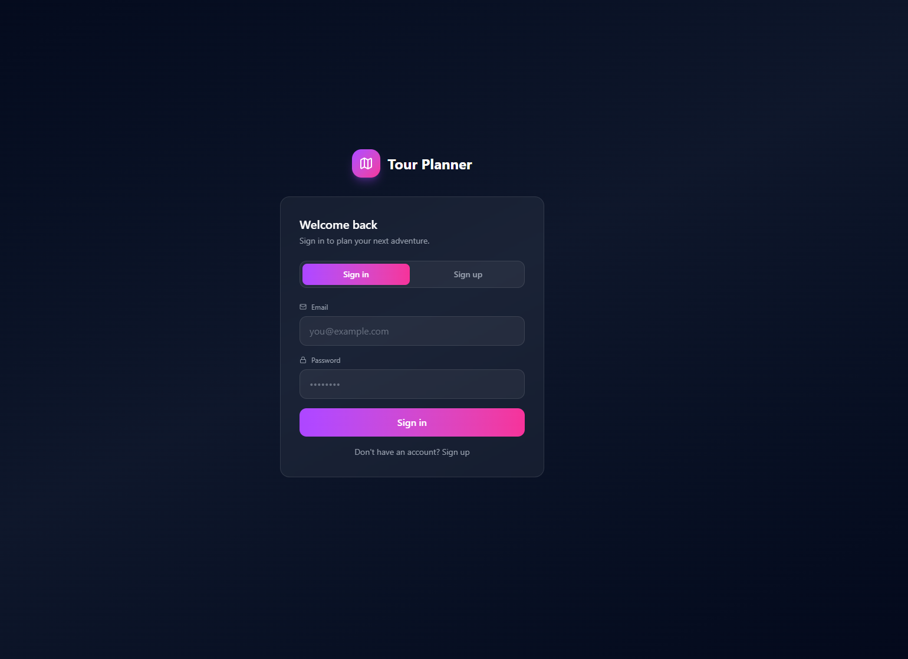

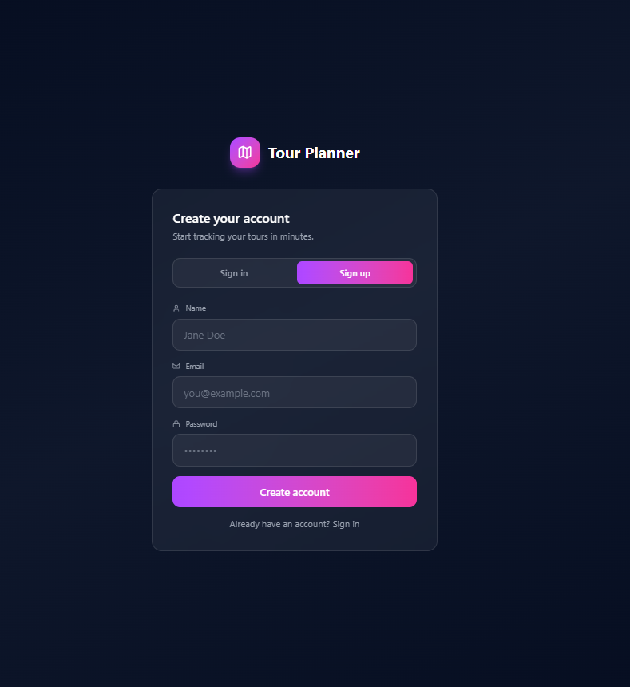


### 10.2 Main app layout

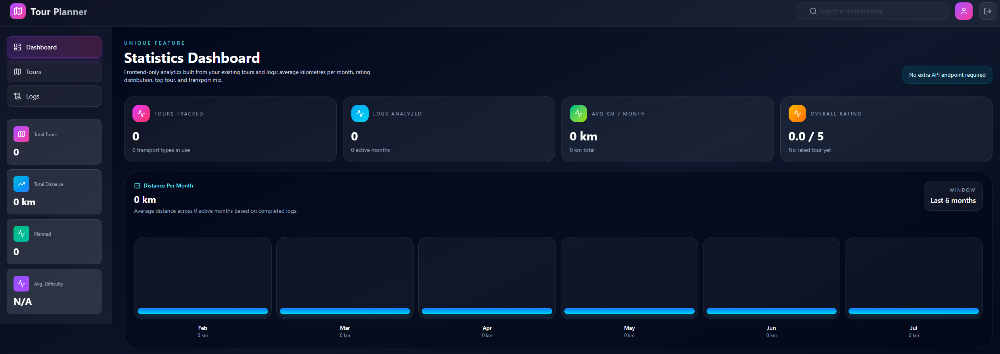

### 10.3 Tours flow

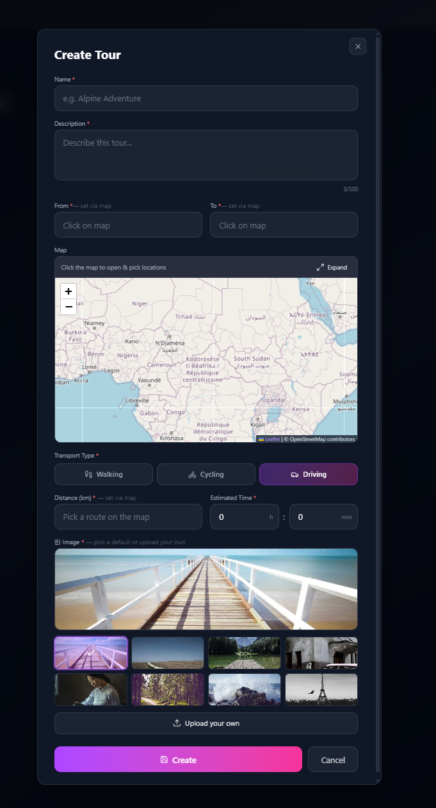

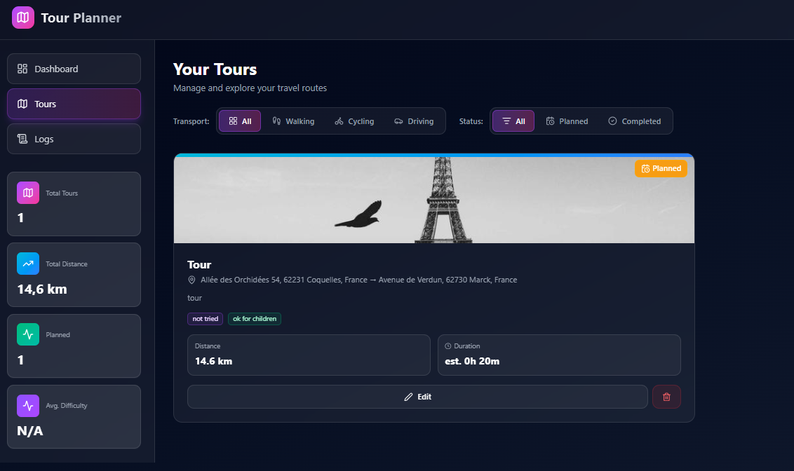

### 10.4 Logs flow 

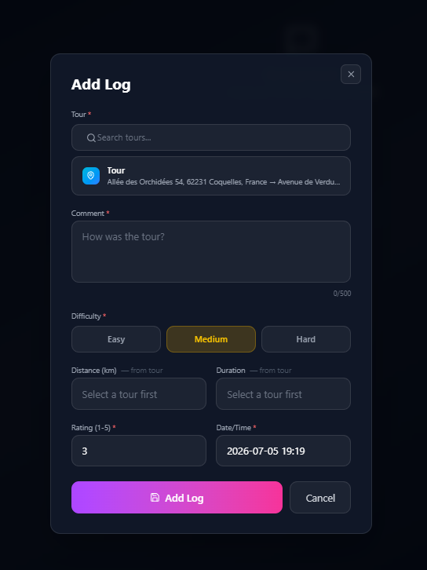


---

## 11. UML Class Diagram

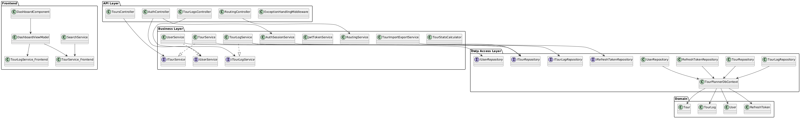

---

## 12. UML Sequence Diagram For Full-Text Search

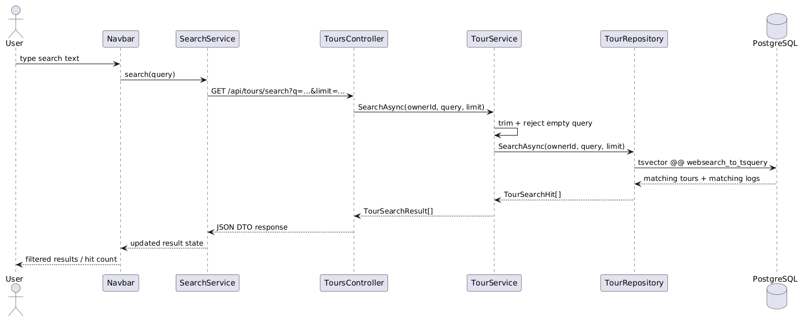

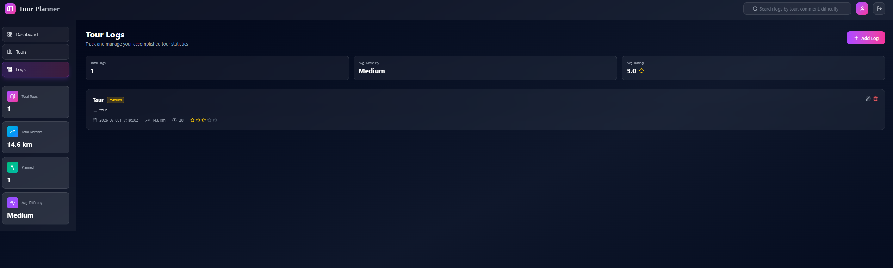

---

## 13. Verification Summary

Verified before hand-in:

- frontend unit tests passed
- frontend production build passed
- backend unit tests passed
- unique feature implemented without extra API endpoint
- startup instructions checked against actual code structure

Known warnings that do not block startup:

- Angular production build is about 25 kB over the configured initial warning budget
- `Microsoft.OpenApi` currently reports a vulnerability warning during .NET test/build
- there is an EF Core relational version mismatch warning during backend build/test

These warnings should be cleaned up in a follow-up pass, but they did not prevent the application from building or the tests from passing.

---

## 14. Final Conclusion

The project fulfills the intended full-stack structure:

- Angular frontend with MVVM
- ASP.NET Core middleware backend
- layered architecture
- PostgreSQL persistence via EF Core
- external route/map integration
- logging
- automated tests
- import/export
- computed tour statistics
- mandatory unique feature

The unique feature was intentionally kept small and focused: a statistics dashboard that reuses existing tour and log data, avoids new endpoints, and is easy to explain, test, and demonstrate during the final presentation.
